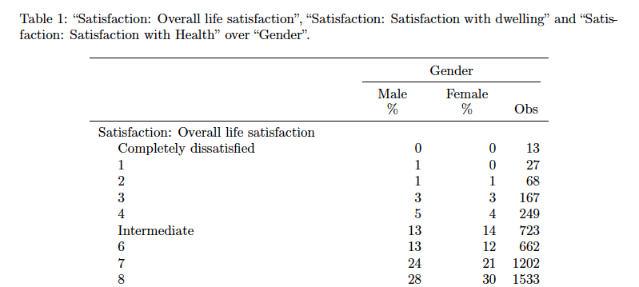

## Mendel

<!--

-->

##### Author: Johannes Schütt, Claudia Saalbach
##### [Chair of Empirical Social Research Methods, University of Potsdam](https://uni-potsdam.de/soziologie-methoden)

 

  

  

Mendel generates twoway tables of metric or categorical variables of a survey response dataset. A user interface allows the selection of dependent and independent variables. Mendel delivers the twoway tables as TeX and PDF files.

<!--
<a href="extras/examples/kksoep_04.tex">
  

    
  

</a>
-->
