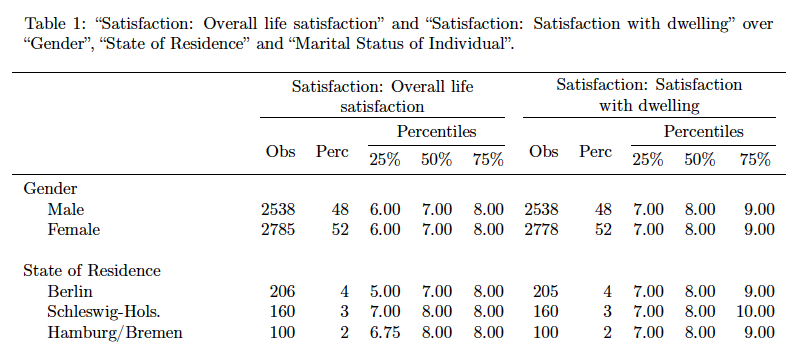

    

  

  

  

  

<h5 align="center">Author: Johannes Schütt, Claudia Saalbach</h5>

<a href="https://uni-potsdam.de/soziologie-methoden" target="_blank"><h5 align="center">Chair of Empirical Social Research Methods, University of Potsdam</h5></a>

 

  

This example can be found <a href="https://gist.github.com/johschuett/b2f901b95fbcabb89320a3a7b6b2f12b#file-kksoep_03-tex">here</a>.

 

### About

Mendel generates fully labeled twoway tables of metric or categorical variables of a survey response dataset. After uploading the metadata of the questionnaire and the response dataset, a user interface allows to choose the dependent and independent variables and the statistics you want to present in your table. Mendel delivers the twoway tables as TEX and PDF files. 
