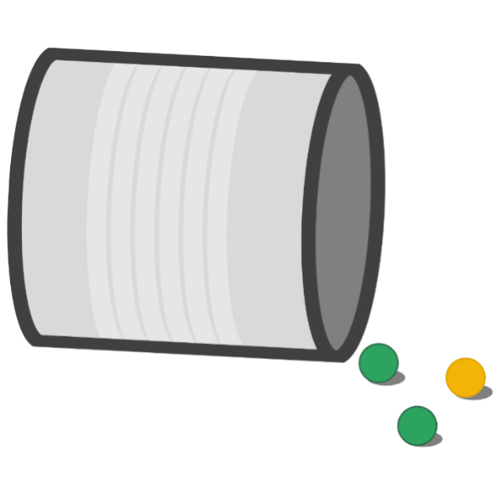

 

## Mendel

##### Author: Johannes Schütt, Claudia Saalbach
##### [Chair of Empirical Social Research Methods, University of Potsdam](https://uni-potsdam.de/soziologie-methoden)

Mendel generates twoway tables of metric or categorical variables of a survey response dataset. A user interface allows the selection of dependent and independent variables. Mendel delivers the twoway tables as LaTeX and PDF files.
